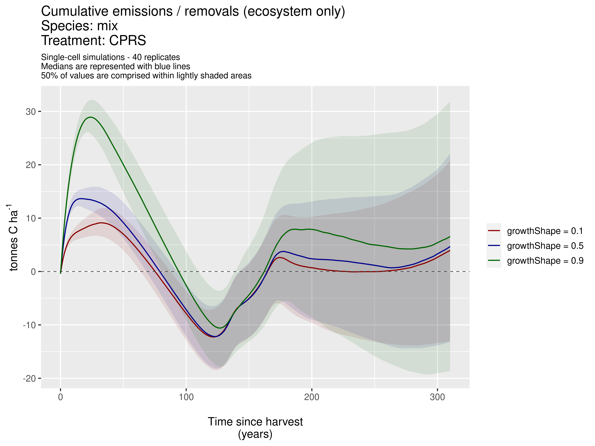
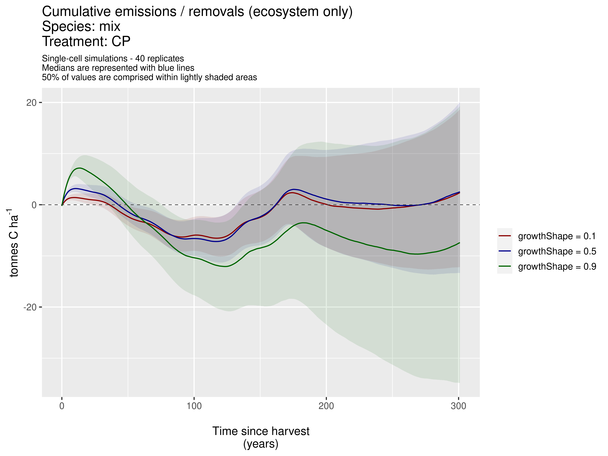
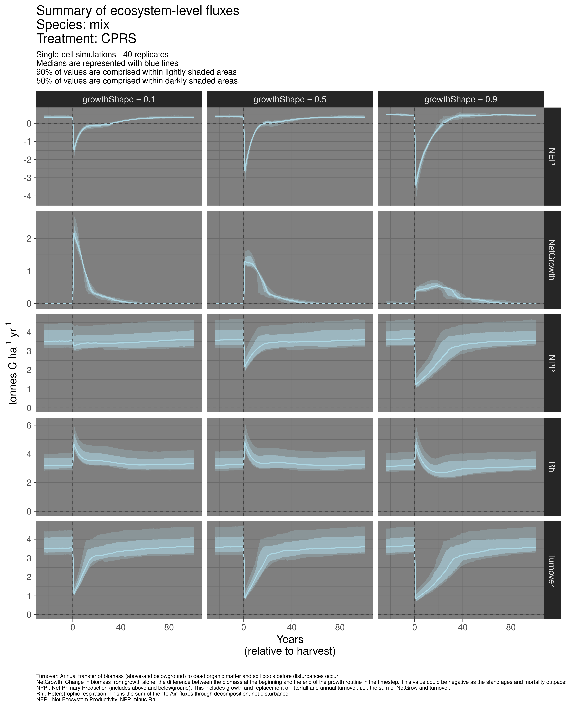
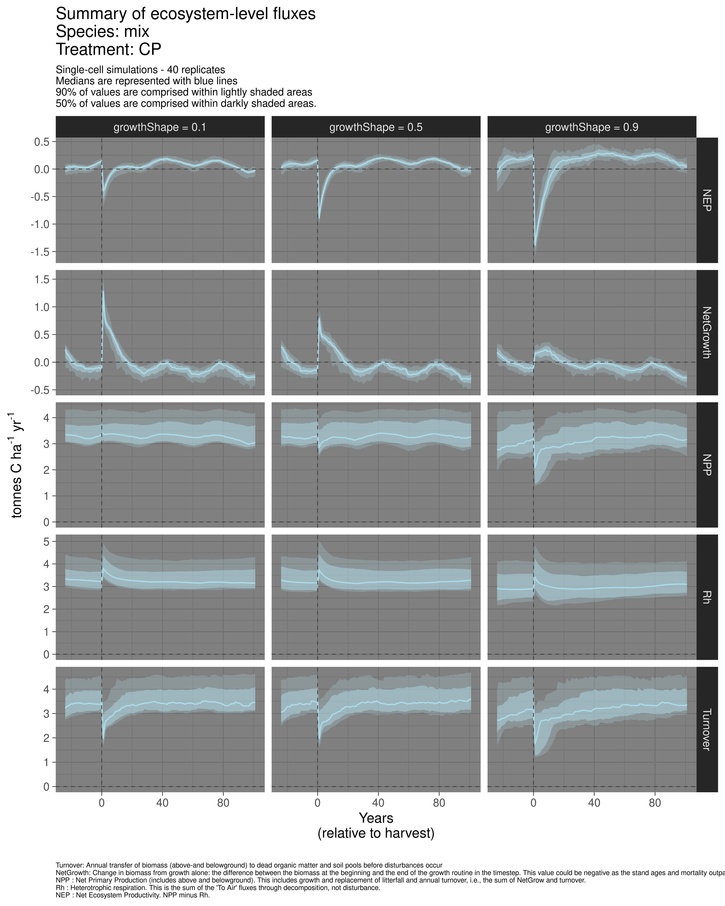
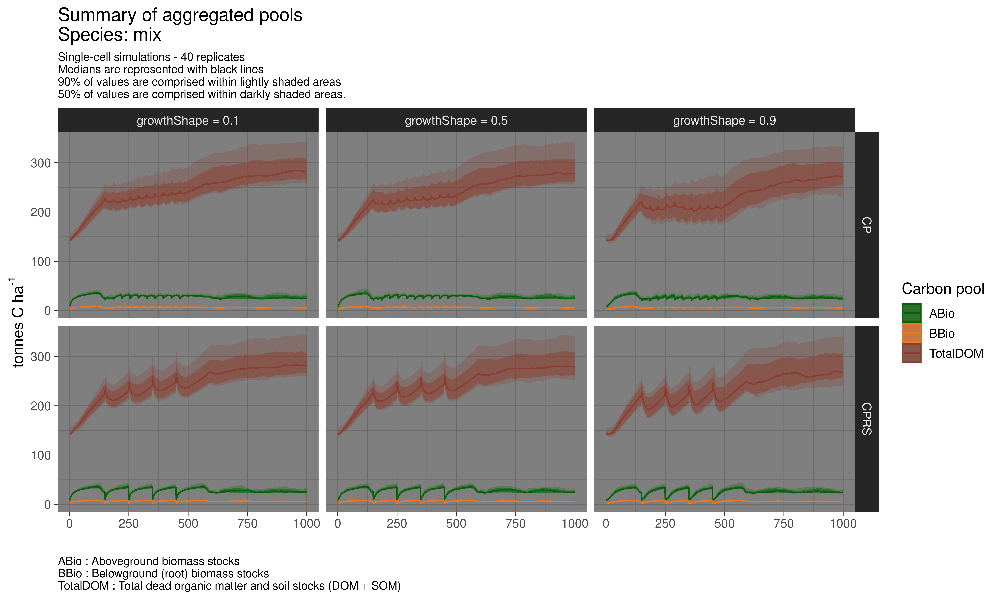

Repository maintained by Dominic Cyr

Updated on Jul 29 2021

-------

### General description

This repository contains input files, scripts, documentation and compiled simulation outputs related to a calibration / validation exercise for the improvement of the representation of carbon dynamics in multiple-cohort stand (preliminary results) using [Landis-II][01] ([Sheller _et al._ 2007][02]) combined with the [Forest Carbon Succession][03] ([Dymond _et al._ 2016][04]) extension. We are using the [Montmorency research and teaching forest][05] of Université Laval as a study area.

[01]: http://www.landis-ii.org/
[02]: http://www.sciencedirect.com/science/article/pii/S0304380006004893
[03]: https://landis-ii-foundation.github.io/Extension-ForCS-Succession/
[04]: https://bg.copernicus.org/articles/13/1933/2016/
[05]: https://www.foretmontmorency.ca/en/

-----------

### Preliminnary results

Based on previous published studies ([Simons-Legaard _et al._ 2015][11]) and submitted manuscript (Landry _et al._ subm to _Forest Ecol Manag_ and Moreau et al. _in prep_) we identified LANDIS-II species-specific growth shape parameter as an important driver of stand development that has a major influence on carbon dynamics. Here are examples of how this parameter can influence stand-level carbon dynamics over time in Forêt Montmorency.

[01]: http://dx.doi.org/10.1016/j.ecolmodel.2015.06.033 

  

-----------

